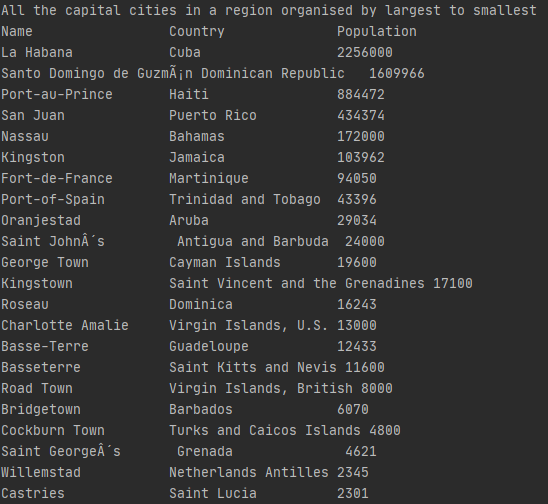

group 1 

# Software Engineering Methods

- Build Status 
- License 
- Release 
- Release Build Status 
- Main Coverage Status 
- master Coverage Status 
- develop Coverage Status 

>*32 requirements* of 32 have been implemented, which is 100%.

| ID  |                                     Name                                                                |  Met | Screenshot |
|-----|:-------------------------------------------------------------------------------------------------------:|------:|------:|
|  1  |  All the countries in the world organised by largest population to smallest.                            |  Yes  |         |   |
|  2  |  All the countries in a continent organised by largest population to smallest.                          |  Yes  |         |   |
|  3  |  All the countries in a region organised by largest population to smallest.                             |  Yes  |         |   |
|  4  |  The top N populated countries in the world where N is provided by the user.                            |  Yes  |         |   |
|  5  |  The top N populated countries in a continent where N is provided by the user.                          |  Yes  |         |   |
|  6  |  The top N populated countries in a region where N is provided by the user.                             |  Yes  |         |   |
|  7  |  All the cities in the world organised by largest population to smallest.                               |  Yes  |         |
|  8  |  All the cities in a continent organised by largest population to smallest.                             |  Yes  |         |
|  9  |  All the cities in a region organised by largest population to smallest.                                |  Yes  |      |
| 10  |  All the cities in a country organised by largest population to smallest.                               |  Yes  |      |
| 11  |  All the cities in a district organised by largest population to smallest.                              |  Yes  |      |
| 12  |  The top N populated cities in the world where N is provided by the user.                               |  Yes  |      |
| 13  |  The top N populated cities in a continent where N is provided by the user.                             |  Yes  |      |
| 14  |  The top N populated cities in a region where N is provided by the user.                                |  Yes  |      |
| 15  |  The top N populated cities in a country where N is provided by the user.                               |  Yes  |      |
| 16  |  The top N populated cities in a district where N is provided by the user.                              |  Yes  |      |
| 17  |  All the capital cities in the world organised by largest population to smallest.                       |  Yes  |      |
| 18  |  All the capital cities in a continent organised by largest population to smallest.                     |  Yes  |      |
| 19  |  All the capital cities in a region organised by largest to smallest.                                   |  Yes  |      |
| 20  |  The top N populated capital cities in the world where N is provided by the user.                       |  Yes  |      |
| 21  |  The top N populated capital cities in a continent where N is provided by the user.                     |  Yes  |      |
| 22  |  The top N populated capital cities in a region where N is provided by the user.                        |  Yes  |      |
| 23  |  The population of people, people living in cities, and people not living in cities in each continent.  |  Yes  |      |
| 24  |  The population of people, people living in cities, and people not living in cities in each region.     |  Yes  |      |
| 25  |  The population of people, people living in cities, and people not living in cities in each country.    |  Yes  |         |
| 26  |  The population of the world.                                                                           |  Yes  |      |
| 27  |  The population of a continent.                                                                         |  Yes  |      |
| 28  |  The population of a region.                                                                            |  Yes  |      |
| 29  |  The population of a country.                                                                           |  Yes  |      |
| 30  |  The population of a district.                                                                          |  Yes  |      |
| 31  |  The population of a city.                                                                              |  Yes  |      |
| 32  |  The country Language of Chinese, English, Hindi, Spanish, Arabic                                       |  Yes  |      |

